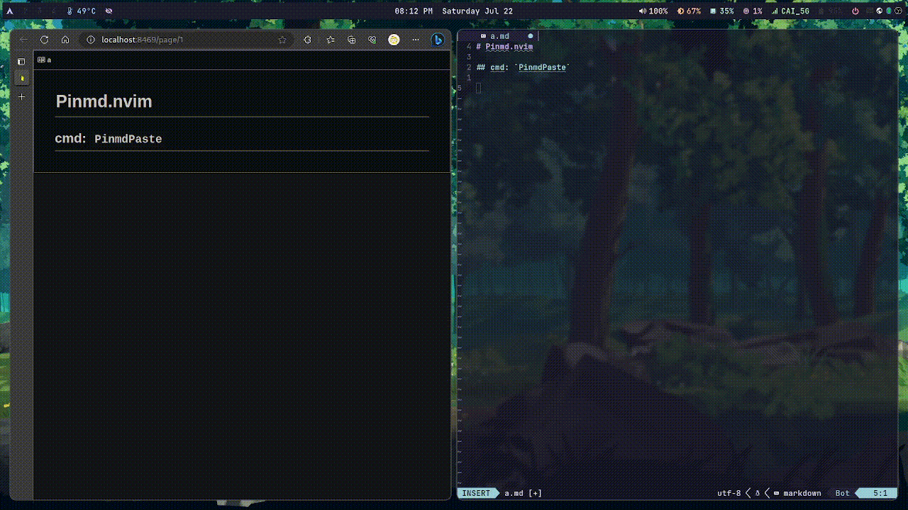

<div align="center">
    <h1>Pinmd</h1>
    <p>Picture In Markdown</p>
</div>

## Install

packer.nvim

```lua
use 'mistgc/pinmd.nvim'
```

lazy.nvim

```lua
{ 'mistgc/pinmd.nvim' }
```

## Usage
cmd: `PinmdPaste`



## Config

Recommend Config:

```lua
options = {
    files = {
        link_format = "relative_path_in_vault",
        location_for_new_attachments = "specified_folder_in_vault",
        attachment_folder_path = "_attachments/" -- folder specified by yourself
    }
}
```

Default Config:

```lua
options = {
    files = {
        link_format = "absolute_path_in_vault", -- "absolute_path_in_vault", "relative_path_in_vault"
        location_for_new_attachments = "vault_folder", -- "vault_folder", "specified_folder_in_vault"
        attachment_folder_path = "assets/imgs/",
    },
    images = {
        name = function()
            return tostring(os.date("%Y-%m-%d-%H-%M-%S"))
        end,
    },
    filetype = {
        default = {
            affix = "%s",
        },
        markdown = {
            affix = "",
        },
        asciidoc = {
            affix = "image::%s[]",
        },
    },
}
```
